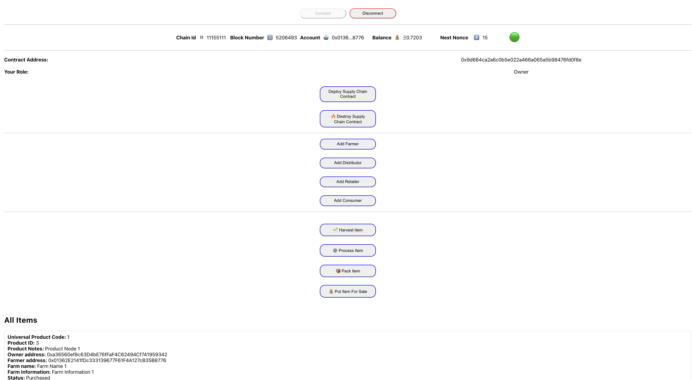
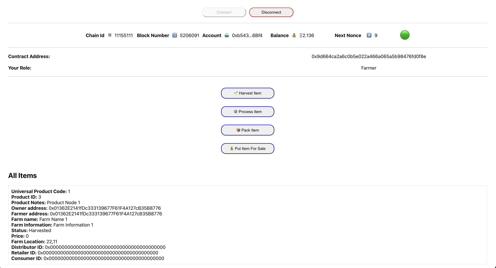
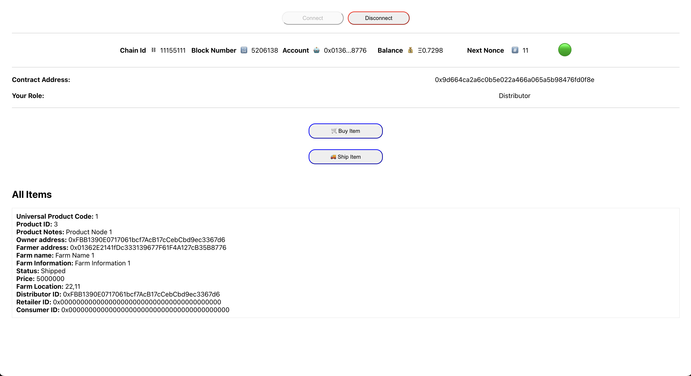
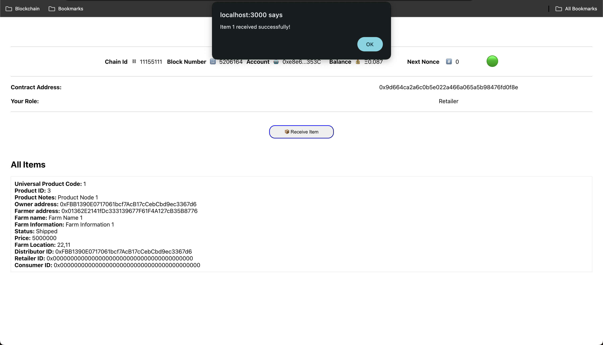
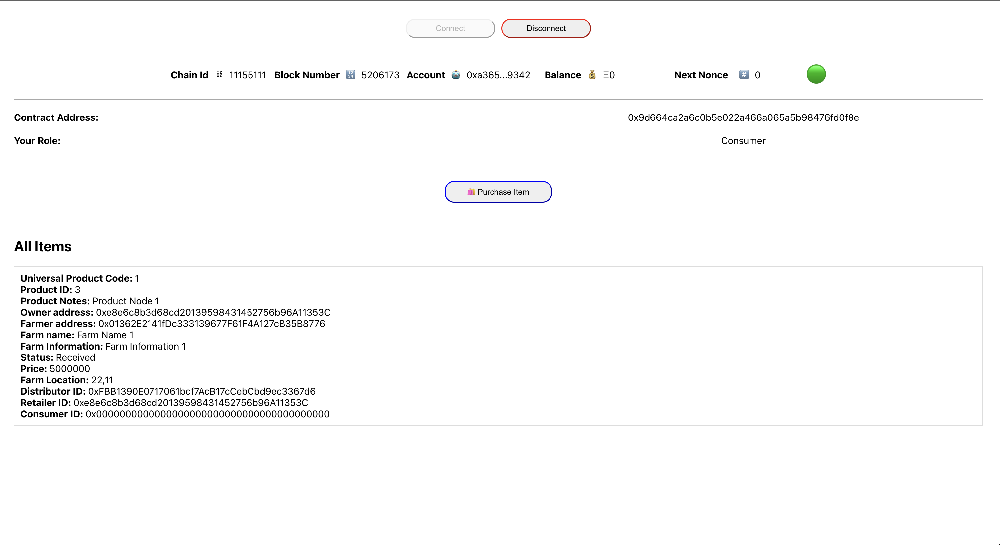
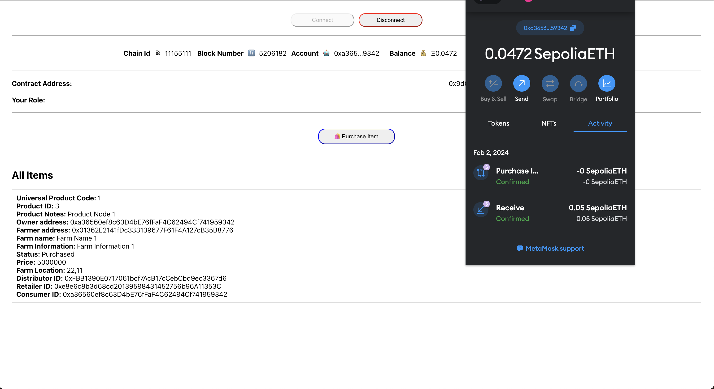
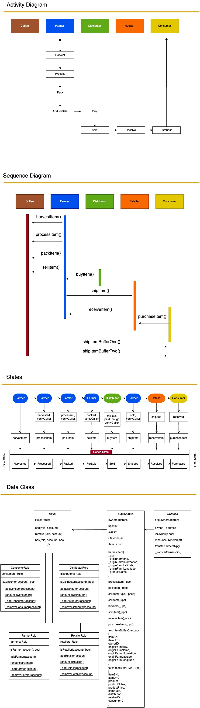

# Supply Chain Dapp

This readme provides information and instructions for running the Supply Chain Dapp, a decentralized application designed to manage the lifecycle of an item from harvesting to purchase. The application utilizes smart contracts on the Ethereum blockchain and allows different roles, such as owner, farmer, distributor, retailer, and consumer, to interact with the supply chain process.

## Contract and Transaction Links

Here are the links to relevant transactions and the contract on the Ethereum blockchain:

- **Deployment Transaction**: 0xd306a6f7cbd118fd4487c45963200be15d6dc4c2278dccd50415d5fa56bb5818 [Click here](https://sepolia.etherscan.io/tx/0xd306a6f7cbd118fd4487c45963200be15d6dc4c2278dccd50415d5fa56bb5818)
- **Contract**: 0x9d664ca2a6c0b5e022a466a065a5b98476fd0f8e [Click here](https://sepolia.etherscan.io/address/0x9d664ca2a6c0b5e022a466a065a5b98476fd0f8e)
- **Harvest Transaction**: 0x439996898f0ac1a4d5f98a2d8a82f2e3fb92b50b5ee9be18d62f756b93e90cce [Click here](https://sepolia.etherscan.io/tx/0x439996898f0ac1a4d5f98a2d8a82f2e3fb92b50b5ee9be18d62f756b93e90cce)
- **Process Transaction**: 0xe4a335acb85e65a6a4a160184e514f5c9539341a684caee83036d4759ae76c0e [Click here](https://sepolia.etherscan.io/tx/0xe4a335acb85e65a6a4a160184e514f5c9539341a684caee83036d4759ae76c0e)
- **Pack Transaction**: 0x90fe3ffa22c1f437a3d170a07ac8277adea2f172fba5f9b28759d9f1bb866956 [Click here](https://sepolia.etherscan.io/tx/0x90fe3ffa22c1f437a3d170a07ac8277adea2f172fba5f9b28759d9f1bb866956)
- **Sell Transaction**: 0x9c32ef62dbfbec833431781e38e4c1453226bb628897f7bf7b9f4688babbf355 [Click here](https://sepolia.etherscan.io/tx/0x9c32ef62dbfbec833431781e38e4c1453226bb628897f7bf7b9f4688babbf355)
- **Buy Transaction**: 0x42b9f89b95d9bd18b9fc1e82af009d739f5db378d0726cbf013b0a862e00280d [Click here](https://sepolia.etherscan.io/tx/0x42b9f89b95d9bd18b9fc1e82af009d739f5db378d0726cbf013b0a862e00280d)
- **Ship Transaction**: 0xcc4956f7cf72c4b4a7634bb0df2463051a70d729cfa57b1ecb89eead2878bccd [Click here](https://sepolia.etherscan.io/tx/0xcc4956f7cf72c4b4a7634bb0df2463051a70d729cfa57b1ecb89eead2878bccd)
- **Receive Transaction**: 0x47c24b44aecd3a76985e896fab297146f0826c41a78f1f88a0a6425c8c5f101d [Click here](https://sepolia.etherscan.io/tx/0x47c24b44aecd3a76985e896fab297146f0826c41a78f1f88a0a6425c8c5f101d)
- **Purchased Transaction**: 0x9d24a054f5a0226db27f263cd6f7b8ddf3b888d9459e9b7c8a87b91c5deb68b8 [Click here](https://sepolia.etherscan.io/tx/0x9d24a054f5a0226db27f263cd6f7b8ddf3b888d9459e9b7c8a87b91c5deb68b8)

## About the Supply Chain Dapp

The Supply Chain Dapp is an Ethereum-based application designed to streamline and monitor the supply chain process from the initial harvesting of an item to its purchase by consumers. It incorporates role-based access control, allowing different participants to perform specific actions within the supply chain.

### Roles and Functionalities

- **Owner**: The owner of the contract has full access and control over the entire supply chain process.
- **Farmer**: Farmers can perform actions such as Harvest, Process, Pack, and PutForSale.
- **Distributor**: Distributors can Buy and Ship items.
- **Retailer**: Retailers can Receive items.
- **Consumer**: Consumers can Purchase items.

## Running the Application

To run the Supply Chain Dapp, follow these instructions:

1. Change your directory to the frontend folder:
   ```
   cd frontend/
   ```

2. Install the required dependencies for the frontend:
   ```
   npm install
   ```

3. Return to the project root directory:
   ```
   cd ..
   ```

4. Install the project's root-level dependencies:
   ```
   npm install
   ```

5. Compile the smart contracts:
   ```
   npx hardhat compile
   ```

6. Run the smart contract tests:
   ```
   npx hardhat test
   ```
After running the tests, you can find the successful test results in the [`testResulLog.txt`](./testResulLog.txt) file.


7. Deploy the smart contract to the local Ethereum network (localhost) or the sepolia testnet (update the network name in the command as needed):
   ```
   npx hardhat run ./tasks/deploy.ts --network localhost // Change the network name to 'sepolia' if you want to deploy it on the testnet
   ```

8. Start a local Ethereum node:
   ```
   npx hardhat node
   ```

9. Open another terminal, navigate to the frontend directory again, and start the frontend application:
   ```
   cd frontend/
   npm start
   ```

Note: If you deployed to sepolia, make sure to edit the `.env` file to set the correct variables for `INFURA_PROJECT_ID` and `MNEMONIC`.

## Application Screenshots

Here are some screenshots of the Supply Chain Dapp:














## UML Diagrams

For detailed UML diagrams illustrating the smart contract structure and interactions, please refer to the following files:


- [SupplyChainDiagrams.drawio](https://viewer.diagrams.net/?tags=%7B%7D&highlight=0000ff&edit=_blank&layers=1&nav=1&title=SupplyChain%20Diagram.drawio#Uhttps%3A%2F%2Fraw.githubusercontent.com%2Frezaiyan%2Fsupply-chain-dapp%2Fmain%2FUML%2FSupplyChain%2520Diagram.drawio)

## Libraries Used

### Supply Chain Dapp (Smart Contracts)

- `@nomicfoundation/hardhat-toolbox` (Version: ^4.0.0)
- `chai` (Version: ^4.4.1)
- `dotenv` (Version: ^16.3.1)
- `hardhat` (Version: ^2.19.4)
- `hardhat-deploy` (Version: ^0.11.45)
- `openzeppelin-solidity` (Version: ^4.0)

### Frontend App

- `@testing-library/jest-dom` (Version: ^5.14.1)
- `@testing-library/react` (Version: ^12.0.0)
- `@testing-library/user-event` (Version: ^13.2.1)
- `@types/jest` (Version: ^27.0.1)
- `@types/node` (Version: ^16.7.13)
- `@types/react` (Version: ^17.0.20)
- `@types/react-dom` (Version: ^17.0.9)
- `@types/styled-components` (Version: ^5.1.18)
- `@web3-react/core` (Version: ^6.1.9)
- `@web3-react/injected-connector` (Version: ^6.0.7)
- `ethers` (Version: ^5.5.2)
- `react` (Version: ^17.0.2)
- `react-dom` (Version: ^17.0.2)
- `react-scripts` (Version: 5.0.0)
- `styled-components` (Version: ^5.3.3)
- `truffle-hdwallet-provider` (Version: ^1.0.17)
